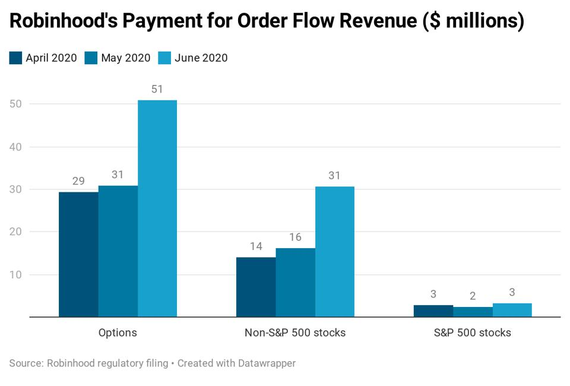
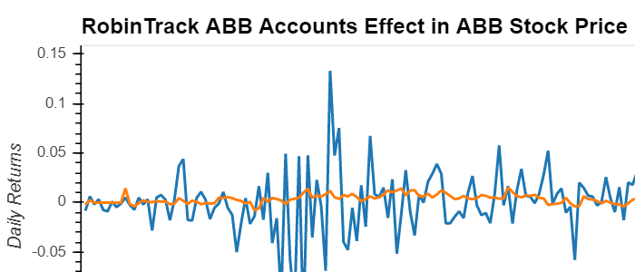
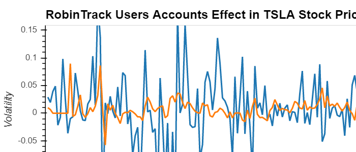
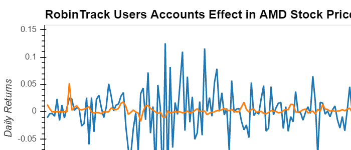
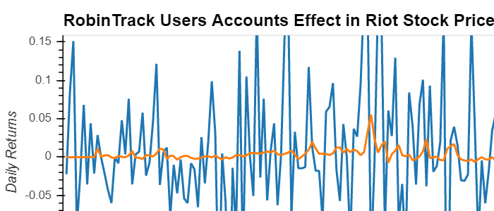
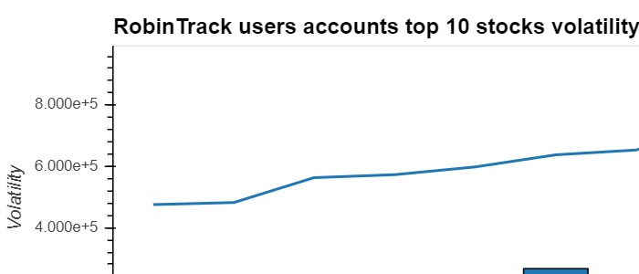
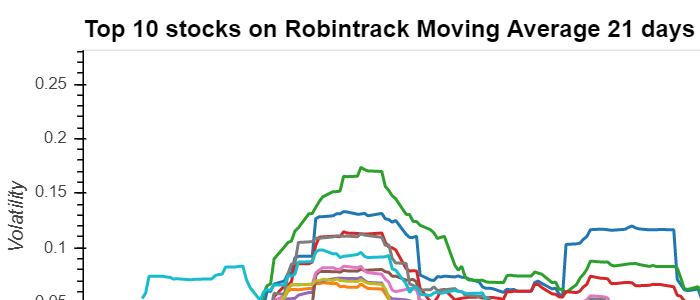
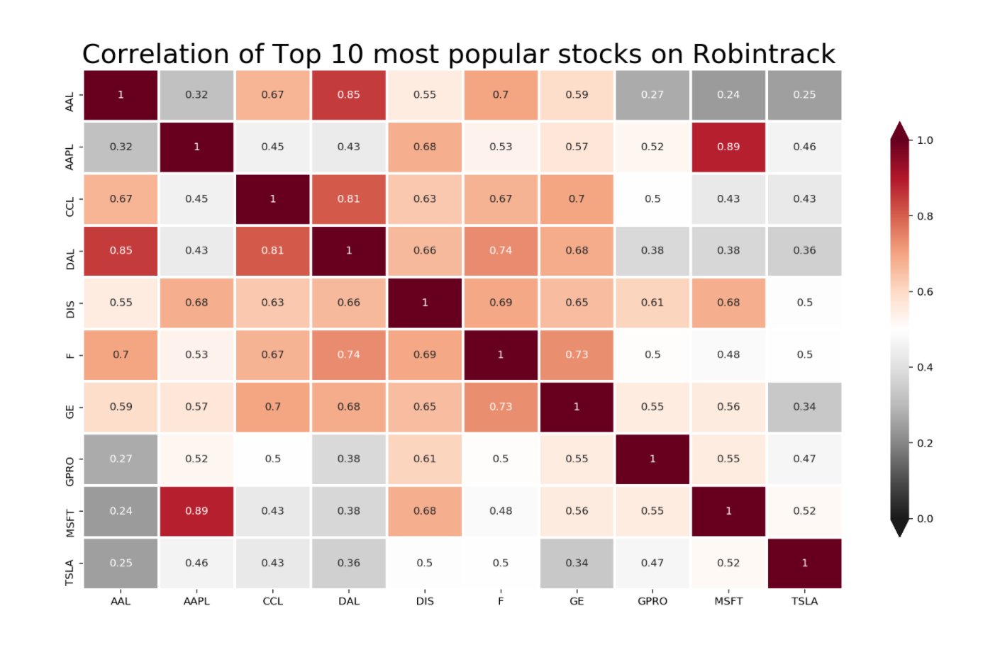
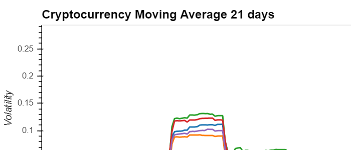

# Effect of Individual Robinhood Accounts on Stocks & Cryptocurrecy
This project analyse the effect of Robinhood accounts on four stocks ABB, TSLA, AMD, and RIOT selected by this group, as well as the top 10 stocks with most users holding in Robinhood. Similarly, this project analyse the effect of Robinhood accounts on the top 5 cryptocurrecy focusing in the ones with most activity by Robinhood accounts.

## _Introduction_
- The economic retraction and uncertainty which accompanied the pandemic lockdown has lent itself to rapid growth in FinTech companies which afford clients greater control over personal finances. For instance, personal portfolio management has grown significantly, to the benefit of stock-trading applications like Robinhood, which saw an increase of three million funded accounts between January and April, as Forbes reports [1]. According to its Q2 SEC regulatory filing, Robinhood's monthly order flow revenue largely trended upward throughout the quarter, which totaled nearly twice that of Q1 [2][3].

.

_Above: Order flow revenue figures between April and June 2020 (via Forbes [4])_

- Previous analyses have suggested that this surge in personal trading has significantly affected portions of the aggregate market and perhaps leading the market's recovery rallies earlier this year [5]. This proposed phenomenon has appropriately been dubbed the "Robinhood Effect."

- Our analysis will evaluate the extent of the Robinhood Effect on the greater US securities market. Additionally, we will highight patterns in the characteristics of the securities Robinhood investors tend to favor, which we believe  will provide a more precise determination of _where_ in the market the Robinhood Effect may be more pronounced.

## _Selection of Data and Period of Analysis_
 - Our analysis begins in January of this year in order to capture the earliest upticks in user growth in companies like Robinhood [6]. We used the API's offered by Robinhood and Alpaca, as well as Yahoo Finance's website to assemble our historical securities prices data. To incorporate Robinhood user statistics, we used a website called Robintrack, which published a daily record of the number individual Robinhood accounts holding different securities until the site shut down in mid-August (which is therefore when our analysis period ends). Robintrack's data up to the point of shutting down was still available for download.

- We will begin by examining four stocks, one of which each of us chose from a different sector, and the number of Robinhood users holding those stocks over our analysis period in order to establish a baseline analysis of four semi-randomly chosen securities. We will then move into our analysis of the top 10 most popular securities among Robinhood users, a sample which we believe is fairly representative of the greatest presence of Robinhood users in the aggregate market. We will evaluate the hypothesis of the Robinhood Effect based on the relationships between movements in prices, numbers of accounts holding, and volatilities of the two aforementioned values for the stocks in this sample.
    
- Finally, in light of the fact that Robinhood saw the registration of over 1 million new accounts in the days following its announcement of the addition of cryptocurrency trading [7], we will examine the relationship between the number of users on Robinhood and the price of the cryptocurrencies available to trade on the app, namely, Bitcoin and Ethereum.

## Results
The results of the analysis on the effect of Robinhood user accounts on stocks and cryptocurrency:

### Dashboard
1) Effect analysis: shows the analysis for the effect of Robinhood acconts on ABB, TSLA, AMD, and RIOT price. 

# Analysis: Four tickers and Top10 

## 1. Determine any potential correlacion between the number of Robinhood inverstors and prices. Consider different industries: Four stocks analysis ABB, TSLA, AMD, RIOT  

### ABB 
* Business: Headquatered in Switzerland, ABB Ltd. supplies products for electricity grids; energy efficient, engineering, robotics 
* Robinhood Investors: Within 2020 the number investors multiplied by a two factor, still only relatively significant (from 2ku to 4ku)
* Price: Very stable ($24 .. $26), impact in Mar/Apr but recovered, the pandemic didn't impact ABB
* Correlation: We do not see any correlation between number investors and price
* Fundamental analysis: Consistent balance sheet compared with stock value 

### TSLA 
* Business: Automotive 
* Robinhood Investors: Within 2020 from 120ku to 550ku, so about four times increase  
* Price: Tesla has been highly volatile in 2020 from $400 to $1400, with a drop in Mach and a big rally since then
* Correlation: We onserve correlation, especially at the begining of the year and since Jun/Jul. We can expeculate that the large increase of RH investors could have an influence in the price 
* Fundamental analysis: Expeculative,  base on GW?, little connexion to P&L-BS

### AMD 
* Business: Semiconductors 
* Robinhood Investors: Evolves from 170ku to 260ku +50% 
* Price: AMD is clearly a winner in current context, with a drop if Mar, since then has grown twice the price  ($40 to $80)
* Correlation: We do not observe correlation between number of Robinhood investors and price
* Fundamental analysis: Consistent with company results P&L-BS and projections in the semicopnductors industry

### RIOT 
* Business: Blockchain 
* Robinhood Investors: Has grown the number of investors by factor of two  (from 15ku to 30ku) 
* Price: Has grown by a four factor ($1 to $4)
* Correlation: We do not observe correlation between number of robinhood investors and price
* Fundamental analysis: Expeculative, trendy, potential, P&L-BS?

### Conclusions  
Only TSLA present some correlation in between volatility of price and number of users, especially at the beginning of the year Feb and july/August

## 2. Behavior of Robinhood investors 
* Top 10 Stocks: number of investors varies from 400ku GoPro to 900ku+ in Ford 
* Stocks with low investment volatility: Investors tend to keep GoPro, TSLA, MSFT, Apple
* Stocks with high investment volatility: In 2020 Investors trade quickly (got rid off) Airlines Delta and American Airlines 
* The line plot shows the number of Robinhood's accounts for each stock. 

## 3. Volatility and correlation of top 10 most popular stocks in Robinhood

### Volatility of top 10 most popular stocks in Robinhood
The analysis of top 10 most popular stocks was determined by using the rolling moving average of the standard deviation at 21 days for all 10 stocks. The result shows that GPRO, CCL, TSLA, DAL, DIS, AAL, MSFT, AAPL, GE, and F had have a similar volatility behavior even though they are group by different market sectors. Since January through August 2020 all 10 stocks had been moving together; however, AAL, CCL, and DAL had been over the average of volatility, which indicated that Robinhhod inestor are taking very risky investments.

### Correlation of top 10 most popular stocks in Robinhood
The correlation of top 10 most popular stocks was determined by claculating the correlation among the stocks. The strogest correlation are among stocks from the same market sector such as AAPL and MSFT 0.89. However, there are some interesting correlation among stocks from different sector such as AAPL and DIS or DIS and MSFT both have the same correlation 0.68.

## 4. Volatility and correlation of cryptocurrency in Robinhood
                                                  

### Correlation of cryptocurrency in Robinhood
* BTC correlation with the number of Robinhood's users 0.43,
* DOGE correlation with the number of Robinhood's users 0.53,
* ETH correlation with the number of Robinhood's users 0.62,
* LTC correlation with the number of Robinhood's users -0.39,
* XRP correlation with the number of Robinhood's users -0.16.

We find that for the most part, there is little correlation between cryptocurrency prices and the number of Robinhood user accounts. There is a moderate correlation for Ethereum, however, which we speculate may be due to its lower price point relative to the other cryptocurrency tradable on Robinhood, Bitcoin, or to its higher volatility, which would be consistent with the stronger relationship between the price and number Robinhood users holding Tesla, a volatile stock.

## _Summary_

In conclusion, we have have found little evidence of the Robinhood Effect moving stock prices, even for the top ten most popular stocks among Robinhood users. Even in cases such as Tesla, where a correlation between the number of users and the price of the stock exists,the pattern we see from the data is that spikes in the volatility of the numbers of users holding the stock are preceded by spikes in price volatility. This would imply that in the case of stocks like Tesla, the stock price has a greater affect on the number of Robinhood users holding the stock than vice versa.

## **Citations:**
   

1, 2, 4 https://www.forbes.com/sites/jeffkauflin/2020/08/03/robinhood-doubles-its-second-quarter-trading-revenue-reaching-180-million/?sh=55395bd9768c

3 https://cdn.robinhood.com/assets/robinhood/legal/RHS%20SEC%20Rule%20606a%20and%20607%20Disclosure%20Report%20Q2%202020.pdf

5, 6 https://financhill.com/blog/investing/robinhood-effect-on-stock-market

7 https://www.investopedia.com/news/robinhood-app-thrives-bitcoin/
