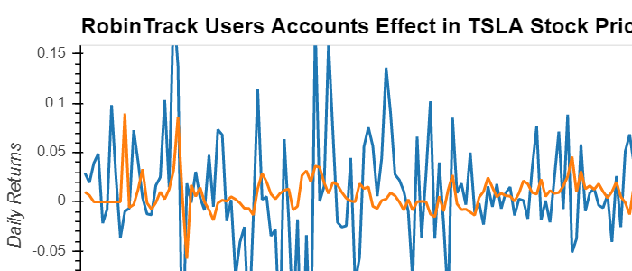

# Effect of Individual Robinhood Accounts on Stocks & Cryptocurrecy
This project analyse the effect of Robinhood accounts on four stocks ABB, TSLA, AMD, and RIOT selected by this group, as well as the top 10 stocks with most users holding in Robinhood. Similarly, this project analyse the effect of Robinhood accounts on the top 5 cryptocurrecy focusing in the ones with most activity by Robinhood accounts.

## Results
The results of the analysis on the effect of Robinhood user accounts on stocks and cryptocurrency:

### Dashboard
1) Effect analysis: shows the analysis for the effect of Robinhood acconts on ABB, TSLA, AMD, and RIOT price. 

# Analysis: Four tickers and Top10 

## 1. Determine any potential correlacion between the number of Robinhood inverstors and prices. Consider different industries: Four stocks analysis ABB, TSLA, AMD, RIOT  

### ABB 
* Business: Headquatered in Switzerland, ABB Ltd. supplies products for electricity grids; energy efficient, engineering, robotics 
* Robinhood Investors: Within 2020 the number investors multiplied by a two factor, still only relatively significant (from 2ku to 4ku)
* Price: Very stable ($24 .. $26), impact in Mar/Apr but recovered, the pandemic didn't impact ABB
* Correlation: We do not see any correlation between number investors and price
* Fundamental analysis: Consistent balance sheet compared with stock value 

### TSLA 
* Business: Automotive 
* Robinhood Investors: Within 2020 from 120ku to 550ku, so about four times increase  
* Price: Tesla has been highly volatile in 2020 from $400 to $1400, with a drop in Mach and a big rally since then
* Correlation: We onserve correlation, especially at the begining of the year and since Jun/Jul. We can expeculate that the large increase of RH investors could have an influence in the price 
* Fundamental analysis: Expeculative,  base on GW?, little connexion to P&L-BS

### AMD 
* Business: Semiconductors 
* Robinhood Investors: Evolves from 170ku to 260ku +50% 
* Price: AMD is clearly a winner in current context, with a drop if Mar, since then has grown twice the price  ($40 to $80)
* Correlation: We do not observe correlation between number of Robinhood investors and price
* Fundamental analysis: Consistent with company results P&L-BS and projections in the semicopnductors industry

### RIOT 
* Business: Blockchain 
* Robinhood Investors: Has grown the number of investors by factor of two  (from 15ku to 30ku) 
* Price: Has grown by a four factor ($1 to $4)
* Correlation: We do not observe correlation between number of robinhood investors and price
* Fundamental analysis: Expeculative, trendy, potential, P&L-BS?

### Conclusions  
Only TSLA present some correlation in between volatility of price and number of users, especially at the beginning of the year Feb and july/August

## 2. Behabior of Robinhood investors 
* Top 10 Stocks: number of investors varies from 400ku GoPro to 900ku+ in Ford 
* Stocks with low investment volatility: Investors tend to keep GoPro, TSLA, MSFT, Apple
* Stocks with high investment volatility: In 2020 Investors trade quickly (got rid off) Airlines Delta and American Airlines 

## 3. Volatility and correlation of top 10 most popular stocks in Robinhood

### Volatility of top 10 most popular stocks in Robinhood
The analysis of top 10 most popular stocks was determined by using the rolling moving average of the standard deviation at 21 days for all 10 stocks. The result shows that GPRO, CCL, TSLA, DAL, DIS, AAL, MSFT, AAPL, GE, and F had have a similar volatility behavior even though they are group by different market sectors. Since January through August 2020 all 10 stocks had been moving together; however, AAL, CCL, and DAL had been over the average of volatility, which indicated that Robinhhod inestor are taking very risky investments.

### Correlation of top 10 most popular stocks in Robinhood
The correlation of top 10 most popular stocks was determined by claculating the correlation among the stocks. The strogest correlation are among stocks from the same market sector such as AAPL and MSFT 0.89. However, there are some interesting correlation among stocks from different sector such as AAPL and DIS or DIS and MSFT both have the same correlation 0.68.

                                                  

